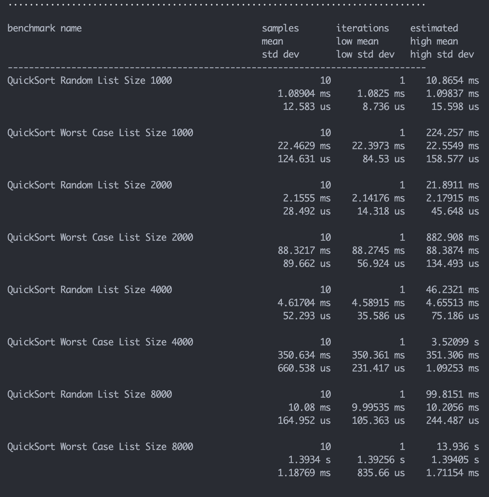
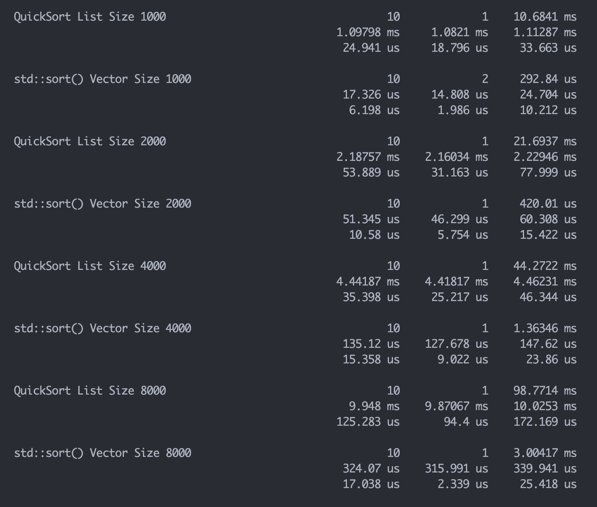

# Assignment 4 - Short Answers

Please edit this file by filling in your answers to the questions as described in the assignment description. You submit your answers together with the commit of the code you are going to produce as part of this assignment.

## Question 1. 

What is a different legal path through the example labyrinth that gathers all three needed items?

(Ans)

WNNEWSSEESNWSWWN

## Question 2

Describe what your debugger shows you whenever you introspect an end iterator in the Variables pane of VSCode.

(Ans)

It shows a hex value 0x0000000000000000

## Question 3

If the `print_list` utility function were implemented recursively, give a rough estimate of the maximum length list it could successfully handle. (Hint: refer back to your investigations for the [warmup in assignment 2](./../assignment2/warmup.md).) What would be the observed result from attempting to `print_list` a list longer than this maximum?

(Ans)

Given that the maximum stack frames that were allowed on my system in assignment two was $261405$,just before illegal access. If I had a list with this many elements in it and print_list was recursively called for each element in the list, then I would get a stack overflow. 

## Question 4

Run time trials (`BENCHMARK` test cases) and provide your timing results here that confirm that your `quick_sort` is $$O(NlogN)$$. Verify the runtime degrades to $$O(N^2)$$ on inputs constructed to trigger the worst case behavior.

(Ans)

When the pivot selected for quick sort is lob-sided or the list to be sorted is already sorted, the algorithm degrades to $$O(N^2)$$. This benchmark for testing quick sort on a sorted list is labeled "QuickSort Worst Case List Size xxxx". When quicksort is ran using non-sorted lists, it falls in $O(NlogN)$ time behavior. This benchmark is labeled "QuickSort Random List Size xxxx".

## Question 5

Run timing trials (`BENCHMARK` test cases) that compare your linked list QuickSort to a `std::vector` sort on the same sequence and report the results. Show your timing for both versions results here. Who wins and why?

(Ans)

Lists provide efficient insertion and deletion of elements compared to vectors which randomly access memory. When inserting or deleting an element from a vector, the entire vector might be getting copied to another memory location which slows down the speed for sorting the vector when compared to the list. 